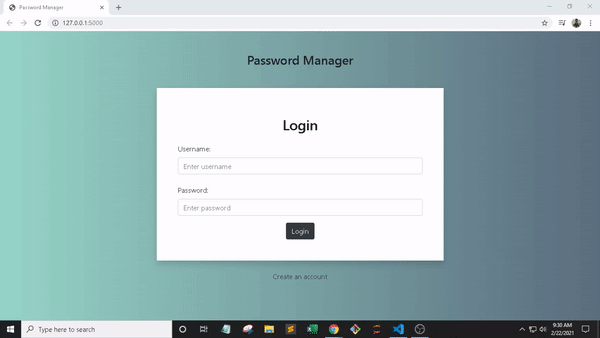

# Password-Manager

Forget no more... created this web app to get in practice on using python flask <br>
All data stored were encrypted. Dont you worry. <br>
Hosted in heroku. Click on this [link](https://mb-password-manager.herokuapp.com/) to try.

### How to run

```
1. pip install -r requirements.txt
2. flask run
```

### Sample




